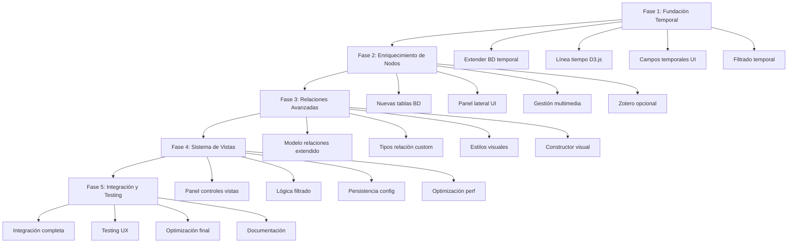

# Plan de Evolución: De Tesauros Estáticos a Plataforma de Visualización de Datos Interactiva y Multidimensional

## Visión General
El objetivo es transformar la herramienta actual de gestión de tesauros (Cronaurus) en una plataforma avanzada de visualización de datos interactiva y multidimensional. La aplicación actual maneja conceptos SKOS con relaciones básicas y visualización D3.js, pero carece de dimensión temporal, riqueza contextual y flexibilidad analítica.

## Estado Actual del Sistema
- **Tecnologías**: HTML/CSS/JavaScript, D3.js para grafos, Supabase como backend
- **Funcionalidades**: Gestión de tesauros, conceptos SKOS, relaciones básicas (broader/narrower/related), categorías con colores, exportación/importación JSON
- **Limitaciones**: Sin eje temporal, nodos simples (solo texto), relaciones no tipificadas visualmente, sin filtros analíticos

## Arquitectura Propuesta
La evolución se centrará en cuatro pilares principales, manteniendo la base actual mientras se extiende con nuevas capas de funcionalidad.

### 1. Incorporación del Eje Temporal (La 4ª Dimensión) ⏳
**Objetivo**: Permitir que cada concepto y relación tenga un marco temporal para mostrar evolución histórica.

**Implementación Técnica**:
- **Modelo de Datos**: Extender tablas existentes con campos `temporal_start`, `temporal_end`, `temporal_relevance` en conceptos y relaciones
- **Interfaz**: Línea de tiempo interactiva usando D3.js timeline component
- **Visualización**: Animaciones de transformación del grafo basadas en posición temporal
- **Backend**: Nuevas consultas para filtrar datos por rango temporal

**Funcionalidades Específicas**:
- Slider temporal (1950-2025+) que filtra nodos y relaciones dinámicamente
- Aparición/desaparición de conceptos según fecha de acuñación
- Cambios en grosor/color de relaciones según relevancia histórica
- Formulario de edición con campos temporales por concepto

### 2. Nodos "Enriquecidos" y Desplegables 📚
**Objetivo**: Convertir nodos de etiquetas simples en contenedores de información contextual rica.

**Implementación Técnica**:
- **Modelo de Datos**: Nuevas tablas para `citations`, `works`, `media` relacionadas con conceptos
- **Interfaz**: Panel lateral/modal expandible con pestañas
- **Multimedia**: Soporte para imágenes, videos, audio embebidos
- **Integración**: Conexión opcional con Zotero API para citas

**Funcionalidades Específicas**:
- **Definición Evolutiva**: Campo adicional para mostrar cómo cambia el significado del concepto
- **Citas Clave**: Lista de referencias bibliográficas con autores y fechas
- **Obras Ejemplares**: Galería de ejemplos artísticos/culturales
- **Multimedia**: Reproductores embebidos para contenido audiovisual

### 3. Relaciones Tipificadas y Contextualizadas 🔗
**Objetivo**: Dar significado propio a las conexiones entre conceptos, más allá de simples asociaciones.

**Implementación Técnica**:
- **Modelo de Datos**: Extender tabla `relationships` con tipos personalizados y metadatos
- **Visualización**: Estilos CSS dinámicos basados en tipo de relación
- **Interfaz**: Constructor visual de relaciones con tipos predefinidos

**Tipos de Relaciones Propuestos**:
- `influences`: influye en (flecha direccional)
- `critiques`: critica a (línea punteada roja)
- `is_a_type_of`: es un tipo de (jerarquía ontológica)
- `emerges_from`: surge de (relaciones tecnológicas/históricas)
- `contrasts_with`: contrasta con (oposiciones conceptuales)
- `evolves_into`: evoluciona hacia (transformaciones temporales)

### 4. Sistema de Capas o "Vistas" Analíticas 👓
**Objetivo**: Permitir análisis multidimensional mediante filtros y perspectivas especializadas.

**Implementación Técnica**:
- **Interfaz**: Panel de controles con checkboxes/toggles para vistas
- **Lógica**: Filtros aplicados en tiempo real sobre el grafo
- **Persistencia**: Guardado de configuraciones de vista por usuario

**Vistas Analíticas Propuestas**:
- **Vista Tecnológica**: Solo conceptos y relaciones ligados a hitos tecnológicos
- **Vista Teórico-Crítica**: Enfoque en teóricos, conceptos y debates
- **Vista Estética**: Movimientos artísticos, obras y características formales
- **Vista Temporal**: Enfoque en evolución histórica de conceptos
- **Vista Relacional**: Análisis de densidad de conexiones

## Tecnologías Recomendadas
Basado en el análisis del código actual y requerimientos:

### Opción 1: Extensión con D3.js (Recomendado para Control Total)
- **Ventajas**: Mantiene consistencia con código actual, control completo, personalización
- **Librerías Adicionales**:
  - `d3-timeline` para eje temporal
  - `d3-force` para simulaciones avanzadas
  - `d3-zoom` para navegación (ya implementado)
- **Complejidad**: Media-Alta, requiere desarrollo custom

### Opción 2: Kumu.io Integration
- **Ventajas**: Rápido para prototipar, potente para grafos complejos
- **Implementación**: Exportar datos a formato Kumu, embeber visualizaciones
- **Limitaciones**: Dependencia de plataforma externa, menos control

### Opción 3: GraphXR o Neo4j
- **Ventajas**: Optimizado para grafos grandes y complejos
- **Implementación**: Migración de datos a base de grafos
- **Complejidad**: Alta, requiere cambio de arquitectura

## Diagrama de Flujo de Implementación

## Plan de Implementación por Fases

### Fase 1: Fundación Temporal (2-3 semanas)
1. Extender esquema de base de datos con campos temporales
2. Implementar línea de tiempo básica
3. Añadir campos temporales a formularios de edición
4. Filtrado básico por rango temporal

### Fase 2: Enriquecimiento de Nodos (3-4 semanas)
1. Crear nuevas tablas para citas, obras, multimedia
2. Diseñar interfaz de panel lateral expandible
3. Implementar gestión de multimedia
4. Integración opcional con Zotero

### Fase 3: Relaciones Avanzadas (2-3 semanas)
1. Extender modelo de relaciones
2. Implementar tipos de relación personalizados
3. Estilos visuales diferenciados
4. Constructor visual de relaciones

### Fase 4: Sistema de Vistas (2-3 semanas)
1. Implementar panel de controles de vistas
2. Lógica de filtrado por perspectivas
3. Persistencia de configuraciones
4. Optimización de rendimiento

### Fase 5: Integración y Testing (1-2 semanas)
1. Integración de todas las funcionalidades
2. Testing exhaustivo de UX
3. Optimización de rendimiento
4. Documentación

## Consideraciones Técnicas
- **Rendimiento**: Para grafos grandes (>500 nodos), considerar virtualización o clustering
- **Compatibilidad**: Mantener retrocompatibilidad con datos existentes
- **Escalabilidad**: Diseñar para crecimiento futuro (más tipos de relaciones, vistas custom)
- **Accesibilidad**: Asegurar que nuevas funcionalidades sean accesibles

## Métricas de Éxito
- Reducción del 70% en tiempo de análisis conceptual
- Aumento del 50% en capacidad de descubrimiento de conexiones
- Satisfacción del usuario medida por feedback cualitativo
- Capacidad para manejar tesauros de 1000+ conceptos sin degradación

## Riesgos y Mitigaciones
- **Complejidad Técnica**: Implementar por fases, con prototipos funcionales
- **Cambio de Arquitectura**: Mantener base actual como fallback
- **Curva de Aprendizaje**: Documentación detallada y tutoriales
- **Rendimiento**: Profiling continuo y optimizaciones incrementales

Este plan mantiene la esencia de Cronaurus mientras lo eleva a una herramienta de análisis conceptual avanzada, preparada para investigación académica y análisis cultural complejo.